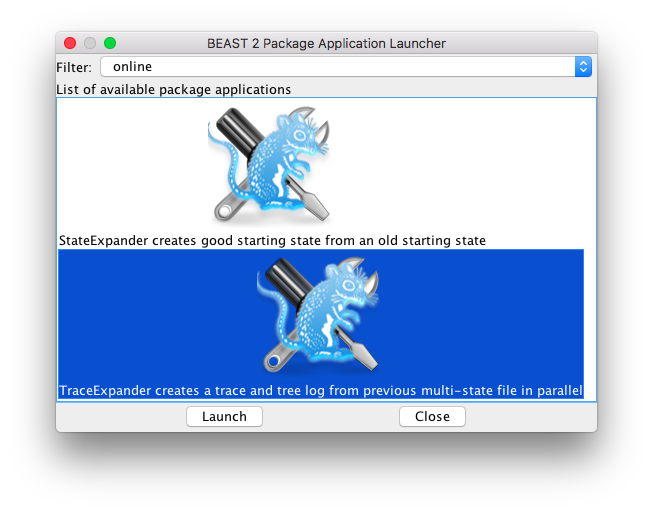

<html lang="en"><head>
<link rel="stylesheet" type="text/css" href="style.css">
</head>


# Background

Once a BEAST analysis is performed, you may want to add or remove taxa when more data becomes available, e.g. during a pandemic. It is also good practice to see how sensitive your analysis is to model choices, so instead of changing the set of taxa, you may want to change a model (e.g. strict clock vs relaxed clock, HKY vs GTR, etc.). Up to now, you would have to restart a new analysis from scratch, and let the MCMC go through burn-in once more. Furthermore, MCMC is inherently a sequential algorithm that does not benefit from parallelism (other than in calculating posteriors). In this tutorial, you will learn how to get around these two limitations, thus saving on time to perform a new analysis. Specifically, you will learn:

* Practical 1: how to re-use an old run when adding (or removing) taxa,
* Practical 2: how to re-use an old run when changing the model,
* Practical 3: do both of the above using parallel computation,

We will also have a look at how change a taxon set of model, but instead of performing an MCMC analysis, we will perform a maximum a posteriori (MAP) or maximum likelihood analysis in Practical 4.

----

# Programs used in this Exercise 

### BEAST 2 - Bayesian Evolutionary Analysis Sampling Trees 2

BEAST 2 is a free software package for Bayesian evolutionary analysis of molecular sequences using MCMC and strictly oriented toward inference using rooted, time-measured phylogenetic trees . This tutorial uses the BEAST 2 version 2.6.7.

### Tracer

[Tracer](http://beast.community/tracer) is used to summarise the posterior estimates of the various parameters sampled by the Markov Chain. This program can be used for visual inspection and to assess convergence. It helps to quickly view median estimates and 95% highest posterior density intervals of the parameters, and calculates the effective sample sizes (ESS) of parameters. It can also be used to investigate potential parameter correlations. We will be using Tracer v1.7.2.


### The online package for BEAST 2

Install the [online](https://github.com/rbouckaert/online) package using the packagemanager. Easiest is to start BEAUti, use the menu `File => Manage Packages`. Then scroll to the online package in the list that pops up and click the `Install` button. 

**Note** If the online package is not available in the package manager, add  `https://raw.githubusercontent.com/rbouckaert/beastbooster/master/packages.xml` to your package repositories (by clicking the `Package Repositories` button, and adding the URL).

Alternatively, you can install it from a terminal using the `packagemanager` utility that comes with BEAST 2. More information on installing packages can be found on the [BEAST 2 website](https://www.beast2.org/managing-packages/). Installing the online package automatically installs the BEASTLabs package, if it was not already installed.

<figure>
	<a id="fig:online1"></a>
	
	<figcaption>Figure 1: Manage packages menu in BEAUti.</figcaption>
</figure>

<figure>
	<a id="fig:online2"></a>
	
	<figcaption>Figure 2: Package manager dialog.</figcaption>
</figure>


### ORC and BICEPS packages	

We will also use the ORC and BICEPS packages for BEAST 2. ORC will be installed when the online package is installed, but BICEPS is to be installed in a similar way as the online package.


------------------------------------------------------------------------------------------

# Practical 1: Adding taxa to a previous analysis


First, we will set up an analysis in BEAUti and run the MCMC in BEAST. Second, we will perform the same analysis (using the same model) but with taxa added. By invoking `TraceExpander`, we can do the second analysis in much less time than running a full MCMC by using the results of the first run.

### Set up and run the initial analysis

We will use yellow fever virus data from  containing 65 taxa from 2017, available in the file `YFV_sequences_2017.fasta`. We set up an HKY + 4G site model, strict clock and BICEPS tree prior on a 35 taxa subset of the full alignment of 65 taxa in BEAUti and run it in BEAST.

> Open BEAUti
>
> Click menu `File => Import alignment`, and select `YFV_sequences_subset.fasta` from the tutorial `data` directory. Select `nucleotide` from the drop down box that pops up.

<figure>
	<a id="fig:online3"></a>
	
	<figcaption>Figure 3: File import alignment menu in BEAUti.</figcaption>
</figure>

<figure>
	<a id="fig:online4"></a>
	
	<figcaption>Figure 4: Partition panel after loading the alignment in BEAUti.</figcaption>
</figure>

>
> In the tip dates tab, select `Use tip dates`, choose `as dates with format` and select `dd-M-yyyy` as format.
>
> Click the `auto-configure` button: a dialog pops up where you select `after last` at the top drop down box, and change underscore to pipe ("|") in the entry next to it. Click the OK button and the date table should now be populated.

<figure>
	<a id="fig:online5"></a>
	
	<figcaption>Figure 5: Setting up tip dates in BEAUti.</figcaption>
</figure>

>
> In the site model panel, set `Gamma category count` to 4, and select `HKY` from the drop down box for `Subst model`.

<figure>
	<a id="fig:online6"></a>
	
	<figcaption>Figure 6: Setting up site model in BEAUti.</figcaption>
</figure>

>
> In the priors panel, select `BICEPS` as tree prior (if BICEPS is not available in the drop down box, you may need to install the BICEPS package first: use the menu `File => Manage packages` to start the package manager). 
>
> Click on the small triangle next to BICPEPS and set `Group count` to 10.

<figure>
	<a id="fig:online7"></a>
	
	<figcaption>Figure 7: Setting up tree prior in BEAUti.</figcaption>
</figure>

>
> In the MCMC panel, set chain length to 1 million, keep log frequencies to 1000 for each of the loggers. You might want to change the trace log file name to `subset.log` and trees file name to `subset.trees`. Using `$(filebase).log` and `$(filebase).trees` respectively produces the same result, and means we do not require changing it later when updating the set of taxa.

<figure>
	<a id="fig:online8"></a>
	
	<figcaption>Figure 8: Setting up MCMC panel in BEAUti.</figcaption>
</figure>

>
> Save (menu `File => Save`) as `subset.xml`.
>
> Open the file `subset.xml` in a text editor and replace `spec="State"` with `spec="online.StorableState"` and also set `storeEvery="10000"`. Save the file. This will ensure a multi-state file will be generated, which we will use when expanding the analysis.
>
> Run the file `subset.xml` with BEAST: from a terminal run "`beast subset.xml`"

This creates the usual trace log, trees file and state file `subset.xml.state`.
You want to check whether the analysis converged by running `Tracer` and load `subset.log`. For a short tutorial like this, we do not need full convergence, but in principle you want all effective sample sizes (ESS) of parameters of interest to exceed 200, and run multiple replicates (say 4) to ensure the MCMC did not get stuck in a local optimum. You can inspect the tree file with `DensiTree`, which comes with the BEAST 2 distribution.

<figure>
	<a id="fig:online13"></a>
	
	<figcaption>Figure 9: Tracer with subset.log.</figcaption>
</figure>


There is also an extra file: the multi-state file `subset.xml.state.multi` that we are going to use to expand the analysis. For this, we need to set up the bigger analysis first.


### Set up and run the bigger analysis with extra taxa

We will add four human samples to the analysis, stored in the alignment `YFV_sequences_larger_subset.fasta`. Like above, we can use BEAUti, load the alignment then go through all panels again. A slightly more efficient way is to load the smaller analysis, and replace the alignment. We need to go through some hoops to update the sample dates as well:

> Open BEAUti
>
> Use menu `File => Load` and select `subset.xml`
>
> Click the alignment in the Partitions panel, then click the small `r` button at the bottom of the screen.
>
> A file dialog appears where you can select `YFV_sequences_larger_subset.fasta` from the tutorial data directory.  Select `nucleotide` from the drop down box that pops up.
>
> Go to the `Tip dates` panel, unselect `Use tip dates` (yes, we will save the file without dates first).
>
> Save the file as `larger-subset.xml`. 
>
> Use menu `File => Load` again, but now select `larger-subset.xml`.
>
> We need to set up tip dates again, just like above: in the tip dates tab, select `Use tip dates`, choose `as dates with format` and select `dd-M-yyyy` as format.
>
> Click the `auto-configure` button: a dialog pops up where you select `after last` at the top drop down box, and change underscore to pipe ("|") in the entry next to it. Click the OK button.
>
> If you did *not* change file names of loggers before, in the MCMC panel, you might want to change the trace log file name to `larger-subset.log` and trees file name to `larger-subset.trees`. 
>
> Save the file.

**Note** you can store alignments and date traits in a separate json file and at startup pass this to BEAST, which will then put the alignment and date trait in the correct place in the BEAST XML file before running the analysis. This way, the data and analysis are separated, and this makes it easy to add or remove sequences from the alignment by just deleting the relevant information from the json file. More information see [github](http://github.com/CompEvol/beast2/tree/master/examples/parameterised/) or [BEAST blog](http://www.beast2.org/2021/03/31/command-line-options.html).


Now, we will run `TraceExpander` (see end of tutorial for all available options), a tool that comes with the online package and can be started with the BEAST app launcher. Most efficient is running it in a terminal, but it can be run through a GUI by selecting menu `File => Launch Apps` in BEAUti, then navigate to the `TraceExpander` utility and click the `Launch` button. All options are shown in a single dialog. 

<figure>
	<a id="fig:online9"></a>
	
	<figcaption>Figure 10: Menu launch apps in BEAUti.</figcaption>
</figure>

<figure>
	<a id="fig:online0"></a>
	
	<figcaption>Figure 11: App launcher.</figcaption>
</figure>

<figure>
	<a id="fig:online1"></a>
	
	<figcaption>Figure 12: TraceExpander app.</figcaption>
</figure>


To launch from the command line:

> Open a terminal
>
> Use

```
applauncher TraceExpander -xml1 subset.xml -xml2 larger-subset.xml -maxCycle 4 -chainLength 2500 -sampleCount 100 
```

> where here and in the following we assume that `applauncher` means `\path\to\BEAST\bat\applauncher.bat` for Windows and `/path/to/beast/bin/applauncher` on Mac or Linux. The `-maxCycle` option determines how many short chains are run for each sample in the log file, `-chainLengh` the length of these short runs, and `-sampleCount` the number of items in each log file. 

**Note** if the `state` file and `multi` file from the BEAST XML run are in a different directory than the `subset.xml` file, you must move them in the same directory. Alternatively, you can specify the path with the `-stateFile` and `-multiStateFile` respectively.


After some time running, log files `cycle0-subset-org.log`, `cycle1-subset-org.log` to `cycle4-subset-org.log` are created. To check for convergence, open these log files in `Tracer`, and check each of the entries for being sampled from the same distribution by looking at the marginal likelihood, as well as checking the traces for any trends. 


### Convergence analysis

At the end of the run, a message appears:

```
Combining /tmp//cycle2_larger-subset-orc.log + /tmp//cycle4_larger-subset-orc.log => larger-subset-orc.log
Combining /tmp//cycle2_larger-subset-orc.trees + /tmp//cycle4_larger-subset-orc.trees => larger-subset-orc.trees
```

to indicate that the trace log and trees log produced will be a combination of the end log file and the half-way log file. If convergence is reached, you can use these to inspect parameters of interest in `Tracer` and the trees in `DensiTree` (comes packaged with BEAST 2). 


Alternatively, the `DistributionComparator` tool that comes with the online package can be used to produce various statistics for comparing two trace log files. For example, to compare cycle 3 with cycle 4, run

```
applauncher DistributionComparator -log cycle3_fullset.log cycle4_fullset.log -singleStat false
```

The `singleStat` option is false by default and you can specify a particular statistic by specifying the `-criterion` option (see end of tutorial for all `DistributionComparator` options). It produces a table like so:

```
cycle3_fullset.log--cycle4_fullset.log
                                                 GR  	SplitR	KS  	mean	KDE 	corr	interval		
posterior                                        0.9978	0.9947	0   	2.6566	0.8008	-0.0926	1.4076	
likelihood                                       0.9994	0.9971	-0   	2.126	1.0597	0.3008	2.1567	
prior                                            0.9948	0.9894	0.0805	0.9073	0.3425	0.2423	1.1092	
treeLikelihood.YFV_sequences_subset              0.9994	0.9971	-0   	2.126	1.0597	0.3008	2.1567	
TreeHeight                                       0.9956	0.9908	0    	1.535	0.4912	0.2153	1.0353	
gammaShape                                       0.9947	0.9896	0.1164	0.8082	0.2142	0.1723	1.3974	
kappa                                            0.9945	0.9895	0.0805	0.3304	0.2339	-0.3317	1.4165	
BICEPS                                           0.9948	0.9894	0.036	0.9191	0.3642	0.2591	1.112	
PopSizes.1                                       0.9944	0.9893	0.6378	0.1069	0.0539	0.2025	1.4625	
PopSizes.2                                       0.9945	0.9893	0.1164	0.3075	0.2232	0.3347	1.1303	
PopSizes.3                                       0.9945	0.989	0.036	0.2259	0.2085	0.2229	1.0974	
PopSizes.4                                       0.9947	0.9894	0.036	0.7752	0.2296	0.2222	1.8077	
PopSizes.5                                       0.9945	0.9895	0.4023	0.3915	0.089	-0.1221	1.001	
PopSizes.6                                       0.9944	0.989	0.5145	0.1029	0.0417	0.1472	1.0239	
PopSizes.7                                       0.9945	0.9889	0.6378	0.1909	0.0634	-0.0711	1.1016	
PopSizes.8                                       0.9945	0.9892	0.6378	0.4259	0.1307	0.1687	1.3903	
PopSizes.9                                       0.9945	0.9891	0.8719	0.2993	0.0673	-0.0168	1.2483	
PopSizes.10                                      0.9951	0.9898	0.0002	1.1349	0.2871	0.1201	1.0533	
GroupSizes.1                                     1    	1    	1    	0    	0    	0    	0    	
GroupSizes.2                                     1    	1    	1    	0    	0    	0    	0    	
GroupSizes.3                                     1    	1    	1    	0    	0    	0    	0    	
GroupSizes.4                                     1    	1    	1    	0    	0    	0    	0    	
GroupSizes.5                                     1    	1    	1    	0    	0    	0    	0    	
GroupSizes.6                                     1    	1    	1    	0    	0    	0    	0    	
GroupSizes.7                                     1    	1    	1    	0    	0    	0    	0    	
GroupSizes.8                                     1    	1    	1    	0    	0    	0    	0    	
GroupSizes.9                                     1    	1    	1    	0    	0    	0    	0    	
GroupSizes.10                                    1    	1    	1    	0    	0    	0    	0
BICEPSPopSize                                    0.9945	0.9891	0.4023	0.2002	0.124	-0.0745	1.1064	
clockRate                                        0.9953	0.9904	0.0018	1.389	0.3936	0.3836	1.4114	
freqParameter.1                                  0.9944	0.989	0.4023	0.1223	0.1331	0.0279	1.0846	
freqParameter.2                                  0.9945	0.9891	0.4023	0.2766	0.1362	-0.0749	1.173	
freqParameter.3                                  0.9944	0.989	0.4023	0.1186	0.0901	-0.1065	1.1386	
freqParameter.4                                  0.9944	0.9891	0.7621	0.0192	0.0933	-0.0119	1.1295	
Total:                                           1   	1   	0.8719	2.6566	1.0597	0.3836	2.1567	
```

The first column is the statistic obtained from the trace log, the following columns are the following statistics:

* GR for Gelman-Rubin statistic, 
* SplitR for use split-R estimate of Gelman-Rubin statistic, 
* KS p-value for Kolmogorov Smirnov test under the null hypothesis that distribution are the same,
* KDE for difference in distribution by kernel density estimate,
* mean for checking difference of means with stdev=(2 * error1 + 2 * error2),
* corr for correlation between pairs of traces,
* interval for fraction of 95% HPD being shrunk.

The last line is the maximum value for the statistic found in the comparison, and in general smaller is better. Furthermore, it takes a bit of common sense to interpret these results. Just because the extreme value would not indicate passable results does not mean the overall analysis has not converged. However, it will point out some of the parameters that appear to vary, which then can be confirmed by inspecting the marginal distributions and traces in Tracer.

**Note** statistics that are constant throughout the analysis (like the GroupSizes in a BICEPS analysis) produce 1 or 0 results for the statistics. These can be ignored as far as convergence analysis is concerned.

**Note** Gelman and Rubin (1992) designed the GR statistic and suggest that values of GR under 1.2 indicate convergence, but in practice a more stringent 1.1 value is used. In this case the maximum GR value does not exceed 1, which is as good as can be expected. However, the KS

If convergence cannot be established, we might need to run it a bit longer. This can be done by giving `TraceExpander` just a single file to run on, like so:

```
applauncher TraceExpander -xml1 larger-subset.xml -maxCycle 4 -chainLength 2500 -sampleCount 100 
```

It may be necessary to increase the `chainLength` option for larger runs.

**Note** Note that the log files produced after each cycle will be overwritten when the `-overwrite` option is set to `true`, which is the default. If you do not want this to happen, set `-overwrite false`. To prevent overwriting files, you can run `TraceExpander` in a different directory, or move the trace and tree log from the previous run elsewhere.

<figure>
	<a id="fig:online12"></a>
	
	<figcaption>Figure 13: DensiTree of larger analysis with newly added taxa in blue. New January samples not very closely related, but new April samples are.</figcaption>
</figure>


------------------------------------------------------------------------------------------

# Practical 2: Changing a model from a previous analysis

We can set up an analysis with say a strict clock, but want to see the effect of changing the clock model to a relaxed clock, so first we create a new analysis with the optimised relaxed clock (ORC) model. 

> Start BEAUti
>
> If you have not already installed the ORC package, install it first.
>
> Use menu `File => Load` and select `subset.xml` to load the analysis with the strict clock.
>
> Go to the `clock model` panel, and select `Optimised Relaxed Clock` from the drop-down box.
>
> Save the XML file as `subset-orc.xml`


### Option 1: resume MCMC from close to end state of `subset.xml.state`

Now, we want to run the relaxed clock analysis without going through burn-in, but by using the end state of the `subset.xml` analysis. First, copy over the state file in a terminal:

```
cp subset.xml.state subset-orc.xml.state
```

Since the mean rate of the clock model changed, and we would like to use it as start state, we can edit the state file and rename the entry for `clockRate.c:YFV_sequences_subset` to `ORCucldMean.c:YFV_sequences_subset`. Alternatively, we can rename the parameter in the XML:

> Open a text editor
>
> Open `subset-orc.xml` in the editor
>
> Search replace all `ORCucldMean.c:YFV_sequences_subset` to `clockRate.c:YFV_sequences_subset`
>
> Save the file

Now, we can run BEAST in resume mode to start off from the end state of `subset.xml` and save on burn-in time (which for this small data is quite minimal, but can be substantial for larger data sets). There will not be information for the sigma and rate parameters of the relaxed clock model, so they will be initialised at default values (0.2 and 0.5 respectively).

In tracer you can see that the tree height changes slightly, and posterior and likelihood are marginally better than for the strict clock.

### Option 2: resume multi-threaded MCMC from `subset.xml.state.multi`

Here, we will use the multi-state file generated in the strict clock run to initialise the relaxed clock run, and run MCMC in parallel for each of the states.
Like for option 1, to initialise the relaxed clock mean rate with the strict clock mean rate, we edit the parameter ID in the XML:

> Open a text editor
>
> Open `subset-orc.xml` in the editor
>
> Search replace all `ORCucldMean.c:YFV_sequences_subset` to `clockRate.c:YFV_sequences_subset`
>
> Save the file

Now, we will run `TraceExpander` taking the `subset.xml.state.multi` as starting states. In a terminal, run `TraceExpander` like so:

```
applauncher TraceExpander -xml1 subset.xml -xml2 subset-orc.xml -chainLength 2500 -maxCycle 4 -sampleCount 100 -criterion never
```

After some waiting, log files `cycle0-subset-org.log`, `cycle1-subset-org.log` to `cycle4-subset-org.log` are created.
To check for convergence, open these log files in tracer, and check each of the entries for being sampled from the same distribution by looking at the marginal likelihood, as well as checking the traces for any trends. 

**Note** you can already inspect cycle log files while they are being created to check for convergence. In case the chain already converged after say 2 cycles, you can stop BEAST, and use the `logcombiner` tool (which comes with BEAST 2) to combine trace logs into a single log (likewise for tree logs).

If it turns out you need to run for longer, run `TraceExpander` again, but now not specifying two XML input files, but just one -- the one you want to resume, like so:

```
applauncher TraceExpander -xml1 subset-orc.xml -chainLength 2500 -maxCycle 4 -proportionPartitioned 0
```

Keep on repeating the process, possibly increasing the chain length and/or max cycle during the process.


------------------------------------------------------------------------------------------

# Practical 3: Breaking down large analyses

We can reduce over all calcalation time for a large analysis by running the analysis on a random subset first, then use `TraceExpander` to run the full analysis with as many threads as are available to us.

### Create random sub-alignment

First, we create a list of taxa in the analysis and store them in a text file, one taxon name per line. Then, we shuffle the file and take the first N entries, which we then grep from the fasta alignment. This can be done as follows:

> Open a terminal, change directory to where the fasta alignment file is, then create a list of taxa in the fasta alignment as follows:

```
grep ">" YFV_sequences_2017.fasta | awk -F">" '{print $2}'> taxa.dat
```

**Note** If you have a file in nexus format, you can use the `Nexus2Fasta` app in the [Babel](https://github.com/rbouckaert/Babel/) package for BEAST 2 to convert to fasta. There are [online](https://www.startpage.com/do/dsearch?query=online+nexus+to+fasta) converters as well.

> Randomise the list of taxa and select the first 35 of them and store them in `taxasubset.dat`

```
perl -MList::Util=shuffle -e 'print shuffle(<STDIN>);' < taxa.dat | head -n 35 > taxasubset.dat
```

> Create an alignment consisting of the subset of taxa

```
grep -A 1 -f taxasubset.dat YFV_sequences_2017.fasta |egrep -v "^--$"> YFV_sequences_subset.fasta
```


### Create analysis of subset

> Open BEAUti
>
> Click menu `File => Import alignment`, and select `YFV_sequences_subset.fasta`. Select `nucleotide` from the drop down box.
>
> In the tip dates tab, select `Use tip dates`, choose `as dates with format` and select `dd-M-yyyy` as format.
>
> Click the `auto-configure` button: a dialog pops up where you select `after last` at the top drop down box, and change underscore to pipe ("|") in the entry next to it. Click the OK button and the date table should now be populated.
>
> In the site model panel, set `Gamma category count` to 4, and select `HKY` from the drop down box for `Subst model`.
>
> In the priors panel, select `BICEPS` as tree prior (if BICEPS is not available in the drop down box, you may need to install the BICEPS package first: use the menu `File => Manage packages` to start the package manager). 
>
>Click on the small triangle next to BICPEPS and set `Group count` to 10.
>
> In the MCMC panel, set chain length to 1 million, set log frequencies to 10000.
>
> Save (menu `File => Save`) as `subset.xml`.
>
> Open the file `subset.xml` in a text editor and replace `spec="State"` with `spec="online.StorableState"` and also set `storeEvery="10000"`. Save the file. 
>
> Run the file `subset.xml` with BEAST.

 
This creates the usual trace log, trees file and state file `subset.xml.state`, but also the multi-state file `subset.xml.state.multi` that we are going to use to expand the analysis.


### Create analysis of full set

> Open BEAUti and import `YFV_sequences_2017.fasta`, then repeat the steps for setting up the tip dates, site model, tree prior and MCMC, then safe as `fullset.xml`
>
> Open a terminal, and run `TraceExpander` like so:

```
applauncher TraceExpander -xml1 subset.xml -multi subset.xml.state.multi -xml2 fullset.xml -sampleCount 100 -maxCycle 4 -chainLength 2000
```

Check convergence as in Practical 1. If you need to resume, simply run

```
applauncher TraceExpander -xml1 fullset.xml
```

**Note** you can change the `threads` option to speed things up and options`chainLength` (default 1000) and `maxCycle` (default -1) to use more realistic chain lengths and cycle counts for your particular analysis.


**Note** if the number of threads *T* available is less than the desired *E/2*=ESS/2 (which it almost always is in practice), you can run with `sampleCount` equal to the number of `threads` *T*. This way, burn-in needs to be only traversed *T* times instead of *E/2* times, thus saving time. Of course, more cycles need to be performed to get the desired ESS, since every cycle now only produces *T* independent samples. To get an ESS of *E*, combine all log files from cycle *N/2* to *N* using `logCombiner`. Care must be taken to set the `chainLength` long enough for samples between cycles to be uncorrelated (which you might want to check with the `DistributionComparator` app).


------------------------------------------------------------------------------------------

# Practical 4: Online maximum a posteriori (MAP) or maximum likelihood (ML) analysis

The difference between a MAP and ML analysis is that the former includes a prior, and the latter only considers the likelihood. To set up a MAP analysis, set up the analysis in BEAUti, then safe as XML. 

> Open BEAUti
>
> Select menu `File=>Import alignment`, select dna9.nex
>
> In the Site Model Panel, select `HKY` as substitution model
>
> In the MCMC Panel, set chain length to 1 million, set log frequency to 100000 (or 1 million, if you only are interested in the final result).
>
> Save the XML as `dna9.xml`

Open the XML in a text editor and search for the `run` element that says `spec="MCMC"`. Replace with `spec="beast.inference.SimulatedAnnealing"`. You can control the temperature trajectory by setting the start and end temperature through the `startTemp` and `endTemp` attributes. The `chainLength` attribute determines how many steps are performed to get from the start to the end temperature: longer chain lengths leed to longer runs, but potentially have less chance of getting stuck in local optima. 
After editing, the run element could look something like this:

```xml
<run spec="beast.inference.SimulatedAnnealing" id="mcmc" chainLength="1000000" startTemp='0.001' endTemp='0.0001'>
```

If you want to run an ML analysis instead of a MAP analysis, delete the prior distribution from the XML (that is, remove the element with `id="prior"` and all the elements nested in it, as well as references to the prior in the loggers). Do not forget to remove the logger referring to the prior as well. You may also remove some operators on hyperparameters of the prior, such as the scale operator for the birth rate of a Yule model. Leaving them in does not affect the result, but is slightly less efficient.

Now, run the XML in BEAST. This produces a trace log, tree log and state file. If you think the state is not sufficiently optimised, resuming the run will take the end state and starts performing simulated annealing with the same temperature trajectory again.

To inspect the parameter values for the MAP or ML state, you can open the log file in Tracer and set burn-in to the same value as number of samples (burn-in is specified in the top left list box, where you can edit the number in the 'burn-in' column). The MAP or ML tree is the 
last tree in the log file.

> Start BEAST on `dna9.xml`
>
> Once finished, open `dna9.log` in Tracer
>
> Set burn-in to 1 million to see MAP (or ML) values of parameters
>
> Open `dna9.trees` in FigTree
>
> Click on the arrow above `Next` at the top of the screen (above the tree) to navigate to the last tree. This is the MAP (or ML) tree.

### Add taxa to the analysis

Load the XML from the previous analysis in BEAUti (menu `File => Load`, not `File => Import Alignment`!). You can replace the alignment by selecting the partition in the partition panel, then select the small `r` button at the bottom of the screen to replace the alignment. A file dialog opens that allows you to select a new alignment with new taxa added, and potentially some taxa removed. 

> Open BEAUti
>
> Use `File => Load` menu, and select `dna9.xml`
>
> Select the partition `dna9` in the partition panel by clicking on it in the table.
>
> Click the small `r` button at the bottom of the partition panel.
>
> A File chooser dialog is shown. Select `dna10.nex`
>
> Save the file as `dna10.xml`.

We will use the `StateExpander` app (see end of tutorial for all available options) from the online package to extend the end state of the previous run to create a good start state for the new run. See end of the tutorial for all `StateExpander` options.
Since we want to optimise, not explore the posterior, we set `chainLength` argument to `StateExpander` to 0. 


You can start `StateExpander` by selecting the `AppLauncher` application that comes with BEAST, or selecting menu `File => Launch apps` in BEAUti.

> Open BEAUti
>
> Select menu `File => Launch Apps`
>
> A dialog pops up. Select `online` from the drop down box to reduce the number of apps being shows, or just navigate to the `StateExpander` icon. Click the `Launch` button.
>
> A new dialog pops up showing the options for the `StateExpander`.
>
> Set `State file` to file `dna9.xml.state`
>
> Set `xml2` to file `dna10.xml`
>
> Set `xml1` to file `dna9.xml`
>
> Set `Chain Length` to 0
>
> Click the `OK` button.

Alternatively from a terminal, run

```
applauncher StateExpander -xml1 dna9.xml -state dna9.xml.state -xml2 dna10.xml -chainLength 0
```

You may need to add paths to files if they are not all in the same directory. `StateExpander` creates a new file, `dna10.xml.state` containing the expanded state. Now, we can run BEAST in resume mode on `dna10.xml` using the expanded state as starting point. 

> Open BEAST
>
> Select `dna10.xml` as BEAST XML file
>
> Select `resume: appends logs to existing files (if any)` to resume from the state file generated by `StateExpander`
>
> Click the `Run` button.


Alternatively from a terminal, run

```
beast -resume dna10.xml
```

Inspecting the results of the analysis goes just as for the analysis of the smaller alignment.

**Note** MAP trees are not necessarily representative for the posterior, and can even be outside of almost all posterior samples produced by MCMC. 

To appreciate this, consider a full balanced tree where the _n_ leaf clusters consist of triplets A_i_,B_i_,C_i_ (1<=_i_<=_n_) that are either ((A_i_,B_i_),C_i_) with 80% probability or (A_i_,(B_i_,C_i_)) with 20% probability. The MAP tree will have all _n_ clusters in the first configuration. A posterior sample will typically have about 20% of the clusters in the other configuration. Only with probability 0.8^_n_ will the MAP tree be in the posterior sample, which is just 10% with _n_=10, and 1% with _n_=20, 0.1% with _n_=30 and 0.01% with _n_=50, just a 150 node tree.

**Note** A MAP state can be useful in being used as starting state for an MCMC run. However, it is not necessarily more efficient than just waiting for MCMC to work through burn-in.


------------------------------------------------------------------------------------------

# All TraceExpander options

`TraceExpander` has the following options:

* xml1 	BEAST XML file with initial state (default: [[none]])
* multiStateFile <filename>	state file containing multiple states associated with initial XML file (xml1).If not specified, use xml1+".state.multi" (default: [[none]])
* stateFile <filename>	state file containing operarator optimisation information associated with initial XML file (xml1). If not specified, use xml1+".state". If that does not exist, ignore. (default: [[none]])
* xml2 	BEAST XML file with expanded state. If not specified, xml2 is set equal to xml1, and we are resuming (default: [[none]])
* chainLength <long>	Length of the MCMC chain used after placement of taxa (default: 1000)
-sampleCount <integer>	determines number of samples taken from multiStateFile evenly selected from multiStateFile. If number of states in multiStateFile > sampleCount some entries may be taken multiple times. If <= 0, use every sample in the multiStateFile (minus burn-in) (default: 200)
* threads <integer>	maximum number of threads to use, if not specified the number of available cores is used (default)
* maxCycle <integer>	maximum number of cycles before stopping. Ignored if negative (4 by default)
* proportionPartitioned <double>	proportion of MCMC chain only using operators local to the part of the tree that changed. If no additional sequences are deteceted this is set to 0. (default: 0.75)
* burnin <integer>	percentage of states in multiStateFile to be used as burn-in (these will be ignored) (default: 10)
* overwrite [true|false]	overwrite existing tree and trace files (default: true)
* verbose [true|false]	show more information if true (default: false)
* threshold <double>	threshold appropriate for convergence criterion, e.g. maximum acceptable value of Gelman Rubin statistic, or minimum p-value for KS test. Set 'criterion' to 'none' to stop after first cycle. (default: 0.4)
* tempDir <string>	directory where temporary files are written. (default: /tmp/)
* criterion [GR| SplitR| KS| mean| KDE| corr| never| always]	If not set to 'none', the chain keeps afterburning (with chainLength steps) till all items in trace log converge. Criterion for testig convergence:always for always accepting equality, never for never accepting equality, GR for Gelman-Rubin statistic, SplitR for use split-R estimate of Gelman-Rubin statistic, KS for Kolmogorov Smirnov test at p=5% KDE for difference in distribution by kernel density estimate mean for checking difference of means with stdev=(2 * error1 + 2 * error2) corr for correlation between pairs  (default: never)
* seed <long>	Specify a random number generator seed
* definitions <string>	comma separated list of definitions used in the XML (like the -D option for BEAST) 


<figure>
	<a id="fig:online13"></a>
	
	<figcaption>Figure 13: Files involved in running TraceExpander.</figcaption>
</figure>

<figure>
	<a id="fig:online14"></a>
	
	<figcaption>Figure 14: Files involved in running resuming TraceExpander.</figcaption>
</figure>

------------------------------------------------------------------------------------------

# All StateExpander options

`StateExpander` has the following arguments:

* stateFile <filename>	state file associated with initial XML file (xml1). If not specified, use xml1+".state" (default: [[none]])
* xml1 	BEAST XML file with initial state (default: [[none]])
* xml2 	BEAST XML file with expanded state (default: [[none]])
* chainLength <long>	Length of the MCMC chain used after placement of taxa (default: 1000)
* proportionPartitioned <double>	proportion of MCMC chain only using operators local to the part of the tree that changed. If no additional sequences are deteceted this is set to 0. (default: 0.75)
* seed <long>	Specify a random number generator seed
* definitions <string>	comma separated list of definitions used in the XML (like the -D option for BEAST) (default: )


<figure>
	<a id="fig:online15"></a>
	
	<figcaption>Figure 15: Files involved in running StateExapander.</figcaption>
</figure>

------------------------------------------------------------------------------------------

# All DistributionComparator options

`DistributionComparator` has the following options:

* log 	two or more trace files to compare
* burnin <integer>	percentage of trace logs to used as burn-in (and will be ignored) (default: 10)
* criterion [GR| SplitR| KS| mean| KDE| corr| interval| never| always]	Criterion for testig convergence:always for always accepting equality, never for never accepting equality, GR for Gelman-Rubin statistic, SplitR for use split-R estimate of Gelman-Rubin statistic, KS for Kolmogorov Smirnov test at p=5% KDE for difference in distribution by kernel density estimate mean for checking difference of means with stdev=(2 * error1 + 2 * error2) corr for correlation between pairs interval for fraction of 95%HPD being shrunk (default: SplitR)
* singleStat [true|false]	consider single statistic from criterion, instead of showing all stats (default: true)

------------------------------------------------------------------------------------------

# Acknowledgements

Big thanks to Lena Collienne for testing the tutorial!

------------------------------------------------------------------------------------------

# Useful Links

- [Bayesian Evolutionary Analysis with BEAST 2](http://www.beast2.org/book.html) 
- BEAST 2 website and documentation: [http://www.beast2.org/](http://www.beast2.org/)
- Join the BEAST user discussion: [http://groups.google.com/group/beast-users](http://groups.google.com/group/beast-users) 

----

# Relevant References



